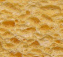
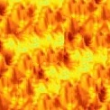
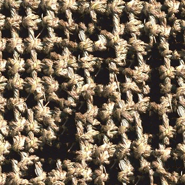
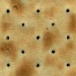
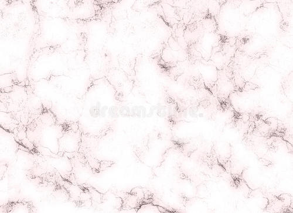

cpp implementation of "Image Quilting for Texture Synthesis and Transfer"
## results
<figure>
  
  
  <br> <br>
  
  
  <br> <br>
  
  
  <br> <br>
  
  
  <br> <br>
  
  
  <br> <br>
  
  
  <br> <br>
  
  
  <br> <br>
  
  
  <br> <br>
  
  
  <br> <br>
  
  
  <br> <br>
  
  
  <br> <br>
  
  
  <br> <br>
  
  
  <br> <br>
  
  
  <br> <br>
  
  
  <br> <br>
  
  
  <br> <br>
  
  
  <br> <br>
  
  
  <br> <br>
  
  
  <br> <br>
  
  
  <br> <br>
  
  
  <br> <br>
  
  
  <br> <br>
  
  
  <br> <br>
  
  
  <br> <br>
  
  
  <br> <br>
  
  
  <br> <br>
  
  
  <br> <br>
  
  
  <br> <br>
  
  
  <br> <br>
  
  
  <br> <br>
  
  
  <br> <br>
  
  
  <br> <br>
  
  
  <br> <br>
</figure>

## requirement
```shell
opencv3
gtest
gflags
```
make sure your `opencv binary file` is in your bash_profile, my opencv lib files are in path: `/usr/local/lib` and my opencv binary files are in path:`/usr/local/bin`

## compile
```shell
mkdir build
cd build
cmake ..
make
```

## usage
```shell
./src/ImageQuilting -input [img path] -output [img path]
```
if you want to know more usage
```shell
image_quilting git:(master) ✗ ./build/src/ImageQuilting -help                                                                                          
ImageQuilting: Usage : ./ImageQuilting 

  Flags from xxx/image_quilting/src/main.cpp:
    -block_size (block size) type: int32 default: 20
    -input (input image path) type: string default: ""
    -output (output image path) type: string default: ""
    -overlap (overlap ratio of block_size) type: double
      default: 0.16666666666666666
    -scale (scaling w.r.t. to image size) type: double default: 2
    -tolerance (error tolerance) type: double default: 0.10000000000000001
```

## running time
I simply takes one example to test running time.

| input size   | block size | scale | time |
| ---------- | -------- | ------------ | -------- |
| 396x658        | 32  | 2.0         | 22s |

## concat information
Welcome to email sukamayluo@sjtu.edu.cn if you have any questions about it.